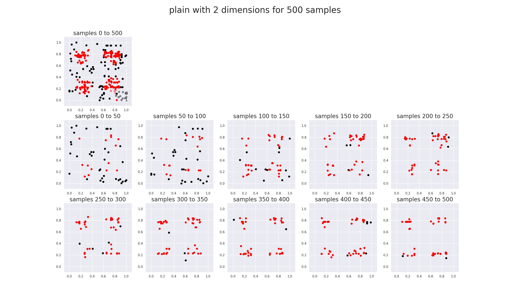
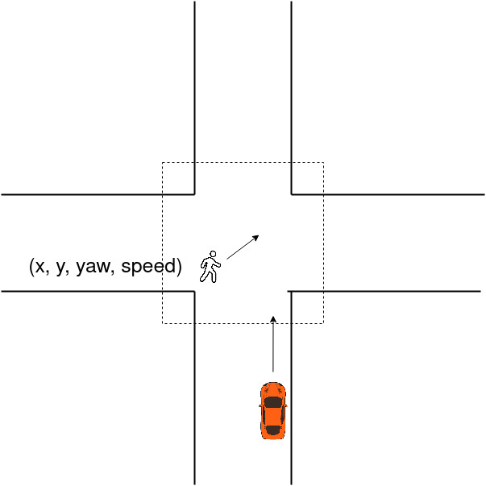
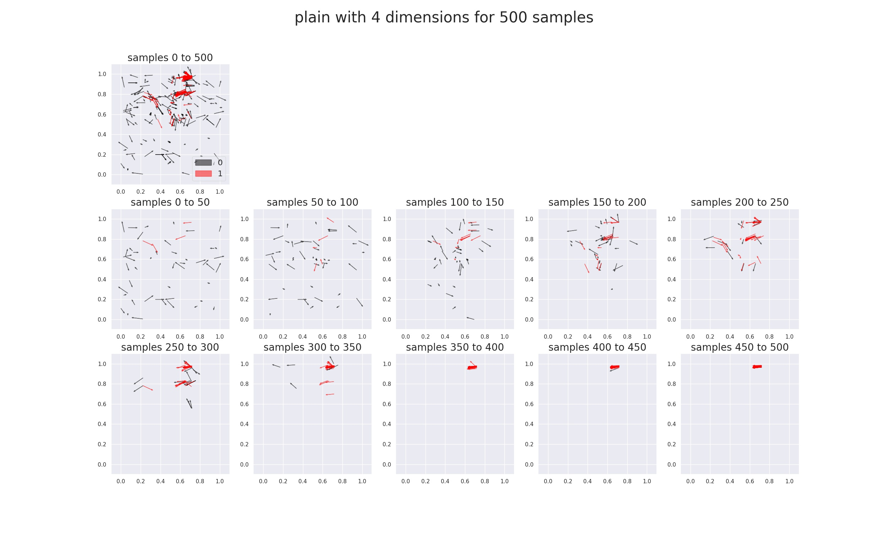
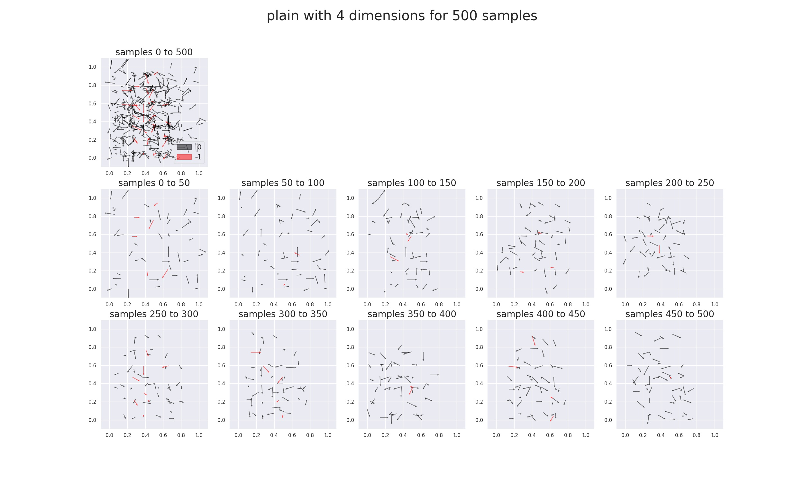

# Visualization
## General Routine
Set folder path and visualization parameters at the end of `analysis_utils/visualize.py` based on the corresponding comments.

Then, run
```
python analysis_utils/visualize.py
```

## Example 1 - No Simulation (Function)
### Oracle
An synthetic function `four_modes` (defined in `no_simulation_function_script/synthetic_functions.py`) is used as the oracle.

### Search Space
```
x1: -1, 1
x2: -1, 1
```

### Commands
Run fuzzing for a specified function using an algorithm one wants to use based on the instruction at [No Simulation (Function)](https://github.com/AIasd/ADFuzz/blob/main/doc/stack4_no_simulation_function.md). Here, we use the algorithm `GA` for the synthetic function `four_modes`.
```
python ga_fuzzing.py --simulator no_simulation_function --n_gen 10 --pop_size 50 --algorithm_name nsga2 --has_run_num 500 --n_offsprings 200 --only_run_unique_cases 0 --use_unique_bugs 0 --synthetic_function four_modes
```

In `analysis_utils/visualize.py`, change `folder_path` to the folder containing the fuzzing result. In this case, it should have a path similar to `no_simulation_function_script/run_results_no_simulation/nsga2/four_modes/<specific folder name with fuzzing starting time>'`.

Make sure `chosen_labels` in `analysis_utils/visualize.py` is a subset of `scenario_labels` in `ga_fuzzing.py` (under the elif block of 'no_simulation_function'). In this case, `chosen_labels = ['x1', 'x2']`

For details of changing other visualization parameters, check out the comments in at the end of `analysis_utils/visualize.py`.

Then, run
```
python analysis_utils/visualize.py
```

The resulted figure is saved in the `folder_path`. The generated figure is shown below:



## Example 2 - CARLA + LBC
### Oracle
The stack [CARLA0.9.9+LBC](https://github.com/AIasd/ADFuzz/blob/main/doc/stack1_carla_lbc.md) is used.

### Search Space
The search space is a logical space about a pedestrian crossing the street starting from a point within a square region of the an intersection. The ego car is passing through the intersection.

The scenario looks like the following:


The search space is:
```
pedestrian_x: -12, 12
pedestrian_y: -12, 12
pedestrian_yaw: 0, 360
pedestrian_speed: 0, 3
```

### Commands
#### GA
```
python ga_fuzzing.py -p 2015 --n_gen 10 --pop_size 50 -r 'town07_front_0' -c 'go_straight_town07_one_ped' --algorithm_name nsga2 --has_run_num 500 --objective_weights -1 1 1 0 0 0 0 0 0 0 --check_unique_coeff 0 0.1 0.5 --record_every_n_step 5 --debug 0 --only_run_unique_cases 0
```

In `analysis_utils/visualize.py`, change `folder_path` to the folder containing the fuzzing result. In this case, it should have a path similar to `no_simulation_function_script/run_results_no_simulation/nsga2/town07_front_0/go_straight_town07_one_ped/lbc/<specific folder name with fuzzing starting time>'`. Set `dim=4` and the `chosen_labels` to `['pedestrian_x_0', 'pedestrian_y_0', 'pedestrian_yaw_0', 'pedestrian_speed_0']`

Then, run
```
python analysis_utils/visualize.py
```

The result is shown below:




#### AutoFuzz
```
python ga_fuzzing.py -p 2015 --n_gen 10 --pop_size 50 -r 'town07_front_0' -c 'go_straight_town07_one_ped' --algorithm_name nsga2-un --has_run_num 500 --objective_weights -1 1 1 0 0 0 0 0 0 0 --check_unique_coeff 0 0.1 0.5 --record_every_n_step 5 --debug 0 --rank_mode adv_nn
```

In `analysis_utils/visualize.py`, change `folder_path` to the folder containing the fuzzing result. In this case, it should have a path similar to `no_simulation_function_script/run_results_no_simulation/nsga2-un/town07_front_0/go_straight_town07_one_ped/lbc/<specific folder name with fuzzing starting time>'`. Set `dim=4` and the `chosen_labels` to `['pedestrian_x_0', 'pedestrian_y_0', 'pedestrian_yaw_0', 'pedestrian_speed_0']`

Then, run
```
python analysis_utils/visualize.py
```

The result is shown below:


